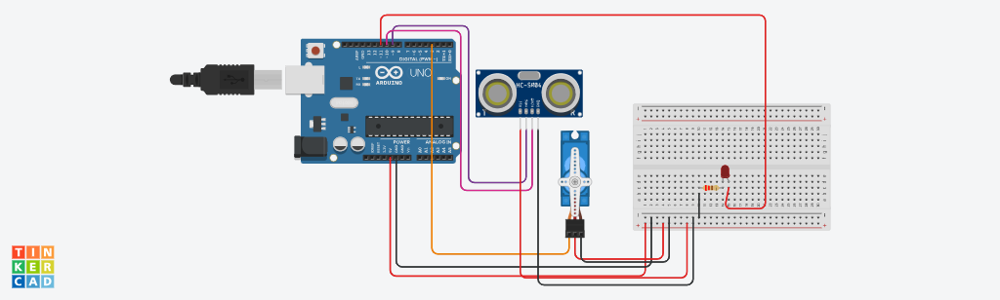

Projeto de sensor de movimento
este projeto foi desenvolvido dentro do trinkercard, na disciplina de internet das coisas (IOT), para a criação de um
prototipo com arduino que simule uma cabeça de robô que ao detectar algum objeto/pessoa/parede a sua frente emita um
sinal ao corpo dele e faça-o girar para o outro lado. Ao encontrar um obstáculo ele deve acender um led vermelho, 
e só depois deve girar o corpo para o outro lado.

Componentes Usados
Arduino Uno - 1
Sensor Ultrassônico HC-SR04 - 1
Servo Motor - 1
LED Vermelho - 1
Resistor (220Ω) - 1
Breadboard - 1
Fios de Conexão - Vários

Montagem do Circuito
Imagem do Circuito

Explicação do código
#include <Servo.h>

// Definição dos pinos
const int trigPin = 9;   // Pino de Trigger do sensor ultrassônico
const int echoPin = 10;   // Pino de Echo do sensor ultrassônico
const int ledPin = 11;    // Pino do LED vermelho
const int servoPin = 3;   // Pino do Servo Motor

Servo meuServo; // Criação do objeto servo

void setup() {
  Serial.begin(9600);      // Inicializa a comunicação serial
  pinMode(trigPin, OUTPUT); // Define o pino do Trigger como saída
  pinMode(echoPin, INPUT);  // Define o pino do Echo como entrada
  pinMode(ledPin, OUTPUT);   // Define o pino do LED como saída
  meuServo.attach(servoPin); // Conecta o servo ao pino definido
  meuServo.write(90);        // Posição inicial do servo (central)
}

void loop() {
  long duracao, distancia;

  // Limpa o pino de Trigger
  digitalWrite(trigPin, LOW);
  delayMicroseconds(2);
  
  // Envia um pulso de 10 microsegundos para o Trigger
  digitalWrite(trigPin, HIGH);
  delayMicroseconds(10);
  digitalWrite(trigPin, LOW);

  // Lê a duração do pulso no pino Echo
  duracao = pulseIn(echoPin, HIGH);
  
  // Calcula a distância em centímetros
  distancia = duracao * 0.034 / 2;

  // Imprime a distância no monitor serial (para depuração)
  Serial.print("Distância: ");
  Serial.print(distancia);
  Serial.println(" cm");

  // Verifica se a distância é menor que 50 cm
  if (distancia > 0 && distancia < 50) {
    digitalWrite(ledPin, HIGH); // Acende o LED
    meuServo.write(0);           // Gira o servo para um lado
    delay(1000);                 // Espera 1 segundo
    meuServo.write(90);          // Retorna o servo à posição inicial
    digitalWrite(ledPin, LOW);   // Desliga o LED
  } else {
    digitalWrite(ledPin, LOW);   // Garante que o LED esteja apagado
  }

  delay(100); // Pequena pausa para estabilização
}
