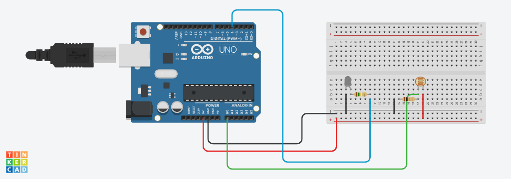

 # Projeto sensor de luz

este projeto foi desenvolvido dentro do trinkercard, na disciplina de internet das coisas
(IOT), para a criação de um prototipo com arduino para fazer um sensor de luz, quando a luz
estiver acima de uma determinada quantidade, ira acender o led.

## Componentes Usados
1 - 1 Arduino Uno
2 - 1 Fotorresistor
3 - 7 Jumpers Macho-Macho
4 - 1 Placa de ensaio
5 - 2 Resistor de 1 KOhms

## Montagem do Circuito

## Explicação do código

int led = 3;                  // Pino do LED (pino digital 4)
int sensorLuminosidade = A0;   // Pino do sensor de luminosidade (pino analógico A0)
int luz = 0;                   // Valor lido pelo LDR

void setup() {
  pinMode(led, OUTPUT);        // Define o pino do LED como saída
  pinMode(sensorLuminosidade, INPUT); // Define o pino do sensor de luminosidade como entrada
}

void loop() {
  // Capturar o valor lido pelo sensor de luminosidade
  luz = analogRead(sensorLuminosidade);
 
  // Se estiver com pouca luz no ambiente (valor abaixo de 500)
  if (luz < 500) {
    //digitalWrite(led, HIGH);   // Ligar LED
   
    //ligar led intesidade maxima
   
    analogWrite(led,1023);
    if(luz>500 & luz < 900){
     analogWrite(led,500);
    }
  } else {
    //digitalWrite(led, LOW);    // Desligar LED
   
    analogWrite(led,0);
  }
}
