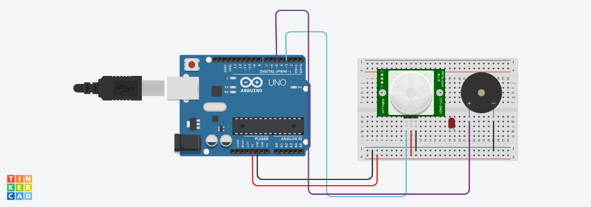

Projeto de sensor de movimento
este projeto foi desenvolvido dentro do trinkercard, na disciplina de internet das coisas (IOT), para a criação de um prototipo com arduino que simule um sensor de movimento, que faz barulho ao aproximar algo.

Componentes Usados
1 - 1 Arduino Uno 2 - 1 Sensor de movimento 3 - 7 Jumpers Macho-Macho 4 - 1 piezo - 1 Placa de ensaio

Montagem do Circuito
Imagem do Circuito

Explicação do código
int sensorPIR = 3; // Define o pino 3 para conectar o sensor PIR (sensor de movimento)
int buzzer = 5;    // Define o pino 5 para conectar o buzzer (dispositivo sonoro)

void setup() {
  pinMode(sensorPIR, INPUT);  // Configura o pino do sensor PIR como entrada (INPUT) para detectar movimento
  pinMode(buzzer, OUTPUT);    // Configura o pino do buzzer como saída (OUTPUT) para emitir som
}

void loop() {
  int detectarPresenca = digitalRead(sensorPIR);  // Lê o estado do sensor PIR (0 = sem movimento, 1 = movimento detectado)
  
  if(detectarPresenca == 1) {   // Se o sensor PIR detectar movimento (valor 1)
    tone(buzzer, 264);          // Ativa o buzzer com um som de frequência 264 Hz
  } else {                      // Caso contrário, se não houver movimento
    noTone(buzzer);             // Desativa o buzzer (não emite som)
  }
}
