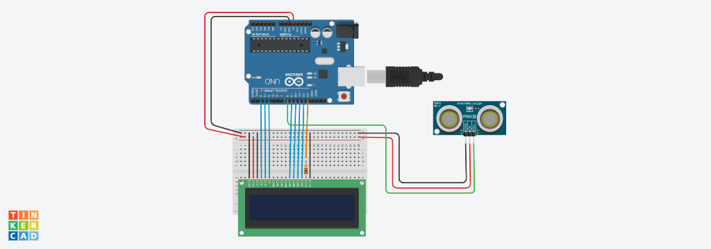

# Projeto de tela LCD com sensor de Distancia

Este projeto foi desenvolvido dentro do Tinkercad, na desciplina de Internet das coisas
(IOT), para a criação de um prototipo com arduino que simule uma mensagem de "MANTENHA
DISTÂNCIA" toda vez que alguém se aproximar a menos de 1 metro do sensor.

## Componentes Usados

1-1 Arduino UNO
2-1 Sensor de distancia
2-14 Jumpers macho-macho
4-3 Jumpers macho-fêmea
5-1 tela LCD 16X2
6-1 Placa de ensaio
7-1 Resistor 1 KOhms

##montagem do circuito

## Explicação do código

biblioteca de LCD
#include <LiquidCrystal.h>
criar a variavel do LCD
LiquidCrystal lcd(2,3,4,9,10,11,12);

int ledLcd =13;

metodo para capturar a distancia
retorna numero quebrado longo
long distancia(int trigger,int echo){
trigger porta de saida

echo porta de entrada
 pinMode(echo,INPUT); definir porta de entrada
 
 return pulseIn(echo,HIGH);
 
}
void setup()
{
 
  pinMode(ledLcd,OUTPUT);  definir ledlcd saida
  digitalWrite(ledLcd, HIGH);   ligar os LEDs do LCD
  lcd.begin(16,2);  informar que o led tem 16 colunas e 2 linhas
  lcd.clear();  iniciar o lcd limpo
 
}

void loop()
{
   transformar o valor recebido paracm
  int cm = 0.01723 * distancia(8, 8);
 
  if(cm<100){ se menor que 1 metro/100cm
 
 
 
 lcd.setCursor(0,0);  iniciar a escrita na linha 0 coluna 0
 lcd.print("MANTENHA");
 lcd.setCursor(0,1);  iniciar a escrita na linha 0 coluna 0
 lcd.print("DISTANCIA!");
  }else{//senão
    lcd.clear(); apague todas as mensagens do display
   
  }
}

